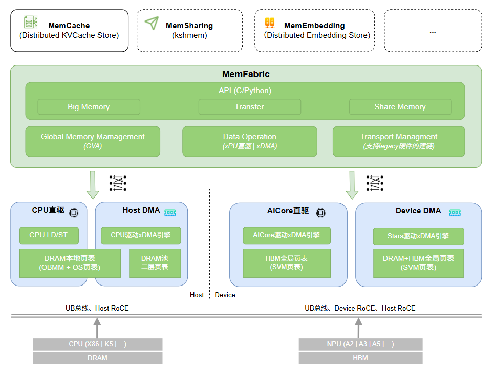
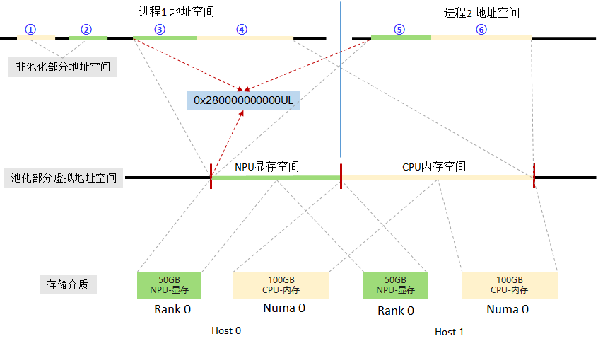
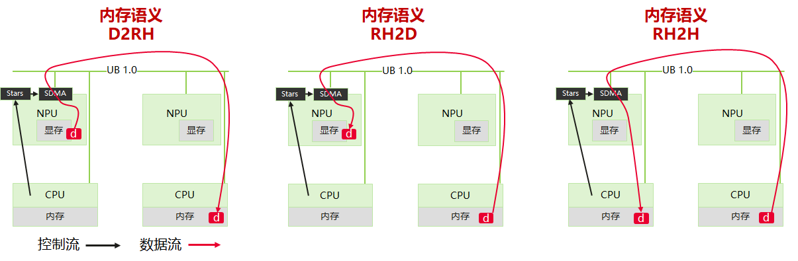
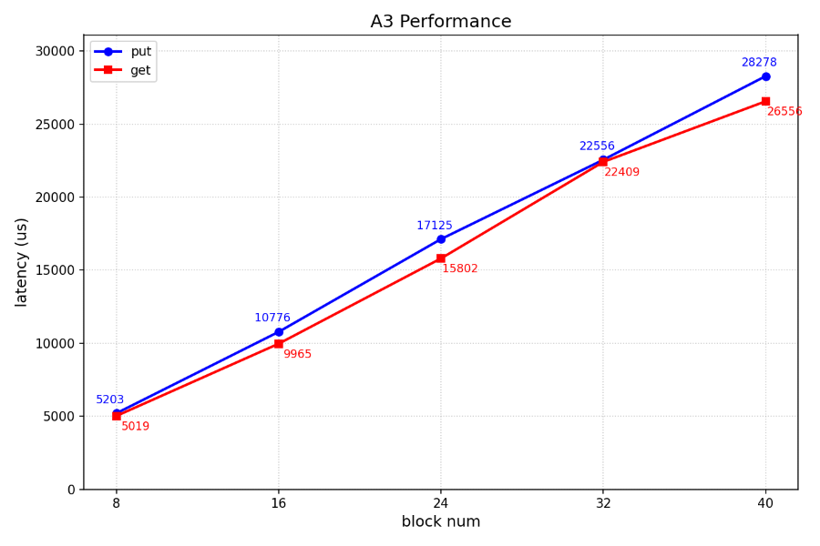
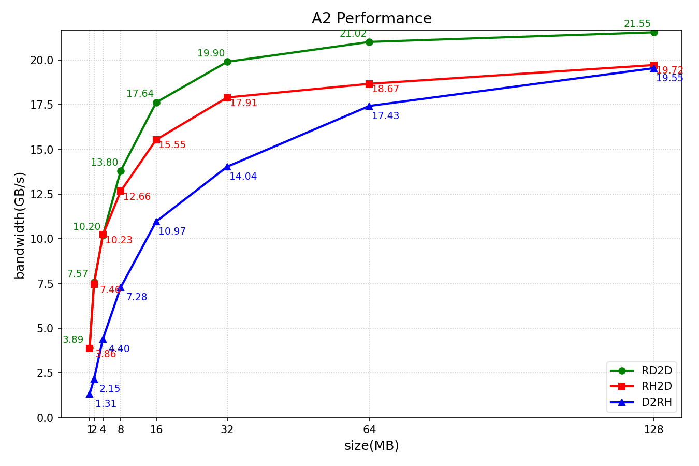

# MemFabric

## 🔄Latest News

- [2025/11] MemFabric项目于2025年11月开源，在昇腾上提供高效的多链路的D2RH,RH2D,RH2H,D2D,D2H,H2D等内存直接访问能力。

## 🎉概述

  MemFabric是一款开源内存池化软件，面向昇腾超节点和服务器等，其设计目的是:
  - 将多节点的异构设备内存(DRAM|显存等)池化且提供高性能的全局内存直接访问的能力
  - 北向提供简单的内存语义访问接口(xcopy with global virtual address)，支持D2RH\RH2D\RH2H等内存直接访问
  - 南向支持多种DMA引擎及多种网络/灵衢互联 (Device UB、Device RoCE、Host UB、Host RoCE等)，对上屏蔽复杂性



如上图所示, MemFabric主要分为四大模块: Global Memory Management、Data Operation、Transport Management、API
  * **Global Memory Management**: 实现GVA的全局编排、页表映射策略制定及通过驱动将映射策略注入页表
  * **Data Operation**: xcopy的实现，驱动xDMA、LD/ST实现全局内存直接读写
  * **Transport Management**: 链接管理; xcopy驱动Host RDMA、Device RDMA、UDMA时，需要建立QP、Jetty链接，xcopy使用SDMA、MTE、LD/ST时不需要Transport Management
  * **API**: 统一且简单的API及其实现, 包括BM API、SHM API、Trans API，三种API适应于不同的场景

其中, Global Memory Management、Data Operation、Transport Management都实现了逻辑的抽象, 可以轻松扩展实现不同硬件的对接。当前已支持的南向包括:
  * 昇腾A3超节点: DRAM+HBM pooling over Device UB 1.0, DRAM pooling over Host RoCE
  * 昇腾A2服务器: DRAM+HBM pooling over Device RoCE, DRAM and HBM pooling over Host RoCE
  * 鲲鹏服务器: DRAM pooling over Host RoCE
  * 鲲鹏超节点: on going

MemFabric以动态库的形式支持应用快速，简便的集成，支撑大模型KV缓存、生成式推荐缓存、强化训练参数Reshard、模型参数缓存、PD传输等多种业务场景。


## 🧩核心特性

- **池化与全局统一编址**

MemFabric通过构建逻辑上的全局内存语义统一编址，对分布在不同层级、不同节点的内存单元进行统一管理与使用，使系统能够像管理单一物理资源一样，对跨CPU、NPU的内存资源进行统一寻址和透明访问，核心目的是实现内存资源的整合与统一调度，最大程度的释放硬件性能。
全局统一内存地址(Global Virtual Address, GVA)的特点:
  - 它是一个简单的uint64
  - 所有进程的gva的起始地址一致
  - 所有进程的gva按线性排布且一致



- **跨机跨介质直接访问**

  基于MemFabric内存语义统一编址，数据可以在跨节点的多级存储间实现透明、直接访问，典型跨节点跨介质的访问路径有：
    - D2RH：本机HBM到跨机DRAM
    - RH2D：跨机DRAM到本机HBM
    - RH2H：跨机DRAM到本机DRAM

  Note: D为Device, RH为Remote Host

MemFabric跨机访问数据流和控制流如下图所示(昇腾A3超节点):




## 🔥性能表现

### 时延测试
- 使用2个昇腾A3节点组成双机内存池，将MemFabric对接到MoonCake TE（MoonCake是业界开源的一款的分布式缓存软件, [对接参考代码](https://github.com/yrewzjs/Mooncake/pull/1/files)）进行读写时延测试，模拟构造DeepSeek-R1模型KV大小的block size，即：61x128K + 61x16K = 8784KB ≈ 8.57MB，共122个离散地址，性能表现如下:



### 带宽测试(单DIE)
- 在昇腾A3超节点跨机数据访问性能(DRAM and HBM pooling over UB 1.0)如下：

| 数据传输方向&nbsp;&nbsp;&nbsp;&nbsp;&nbsp;&nbsp;&nbsp;&nbsp;&nbsp;&nbsp;&nbsp;&nbsp;&nbsp;&nbsp;&nbsp;&nbsp;&nbsp;&nbsp;&nbsp;&nbsp;&nbsp;&nbsp;&nbsp;&nbsp;&nbsp;&nbsp;&nbsp;&nbsp;&nbsp;&nbsp;&nbsp;&nbsp;&nbsp;&nbsp;&nbsp;&nbsp;&nbsp;&nbsp;&nbsp;&nbsp;&nbsp;&nbsp;&nbsp;&nbsp;&nbsp;&nbsp;&nbsp;&nbsp; | 单次数据大小（GB）&nbsp;&nbsp;&nbsp;&nbsp;&nbsp;&nbsp;&nbsp;&nbsp;&nbsp;&nbsp;&nbsp;&nbsp;&nbsp;&nbsp;&nbsp;&nbsp;&nbsp;&nbsp;&nbsp;&nbsp;&nbsp;&nbsp;&nbsp;&nbsp;&nbsp;&nbsp;&nbsp;&nbsp;&nbsp;&nbsp;&nbsp;&nbsp;&nbsp;&nbsp;&nbsp;&nbsp;&nbsp;&nbsp;&nbsp;&nbsp;&nbsp;&nbsp;&nbsp;&nbsp;&nbsp;&nbsp;&nbsp;&nbsp; | 带宽（GB/s）&nbsp;&nbsp;&nbsp;&nbsp;&nbsp;&nbsp;&nbsp;&nbsp;&nbsp;&nbsp;&nbsp;&nbsp;&nbsp;&nbsp;&nbsp;&nbsp;&nbsp;&nbsp;&nbsp;&nbsp;&nbsp;&nbsp;&nbsp;&nbsp;&nbsp;&nbsp;&nbsp;&nbsp;&nbsp;&nbsp;&nbsp;&nbsp;&nbsp;&nbsp;&nbsp;&nbsp;&nbsp;&nbsp;&nbsp;&nbsp;&nbsp;&nbsp;&nbsp;&nbsp;&nbsp;&nbsp; |
|--------------| -----------------| ------------ |
| RH2D         | 1 | 102.66 |
| RH2D         | 2 | 102.62 |
| D2RH         | 1 | 69.42 |
| D2RH         | 2 | 69.42 |
| RD2D         | 1 | 155.04 |
| RD2D         | 2 | 155.04 |
| D2RD         | 1 | 128.53 |
| D2RD         | 2 | 128.53 |

- 在昇腾A2服务器跨机数据访问性能(DRAM and HBM pooling over Device RoCE)如下:



- 性能测试参考 [benchmark](./test/example/bm/BmBenchmark/README.md)

## 🔍目录结构

```
├── LICENSE                                 # LICENSE
├── .clang-format                           # 格式化配置
├── .gitmodules                             # git配置
├── .gitignore                              # git忽视文件
├── CMakeLists.txt                          # 项目的CMakeList
├── doc                                     # 文档目录
├── example                                 # 样例
│  ├── bm                                   # big memory样例
│  └── shm                                  # share memory样例
│  └── trans                                # batch data write/read样例
│  └── decrypt                              # 自定义解密库示例(控制路径)
├── script                                  # 构建脚本
│  ├── build_and_pack_run.sh                # 编译+加包脚本
│  ├── build.sh                             # 编译脚本
│  ├── run_ut.sh                            # 编译+运行ut脚本
├── test                                    # test目录
│  ├── certs                                # 证书生成脚本
│  ├── python                               # python测试用例
│  └── ut                                   # 单元测试用例
├── src                                     # 源码
│  ├── acc_links                            # 内部通信层 (用于进程间控制命令的通信, 基于Host TCP实现) 
│  └── hybm                                 # 内存管理与内存访问层 (Global Memory Management、Data Operation、Transport Management)
│  └── smem                                 # 语义与接口层 (big memory + transfer + share memory等语义与接口实现)
│  └── util                                 # 公共函数
├── README.md
```

## 🚀快速入门

请访问以下文档获取简易教程。

- [构建](./doc/build.md)：介绍组件编译和安装教程。

- [样例执行](./example/examples.md)：介绍如何端到端执行样例代码，包括C++和Python样例。

## 📑学习教程

- [特性介绍](./doc/feature.md)：MemFabric提供的多种API的简介

- [C接口](./doc/API.md)：C接口介绍以及C接口对应的API列表

- [python接口](./doc/pythonAPI.md)：python接口介绍以及python接口对应的API列表

## 📦软件硬件配套说明
- 硬件型号支持
  - Atlas 200T A2 Box16
  - Atlas 800I A2/A3 系列产品
  - Atlas 800T A2/A3 系列产品
  - Atlas 900 A3 SuperPoD
- 平台：aarch64/x86
- 配套软件：CANN 8.1.RC1及之后版本
- cmake >= 3.19  
- GLIBC >= 2.28
- 配套驱动固件依赖(使用不同介质所需最低版本不同)：

  | 特性     | 最低版本需求|
  |--------|----------|
  | HBM池化  | 24.1.RC2 |
  | DRAM池化 | 25.5.0 (*on going*)   |

## 📝相关信息

- [安全声明](./doc/SECURITYNOTE.md)

- [许可证](./LICENSE)