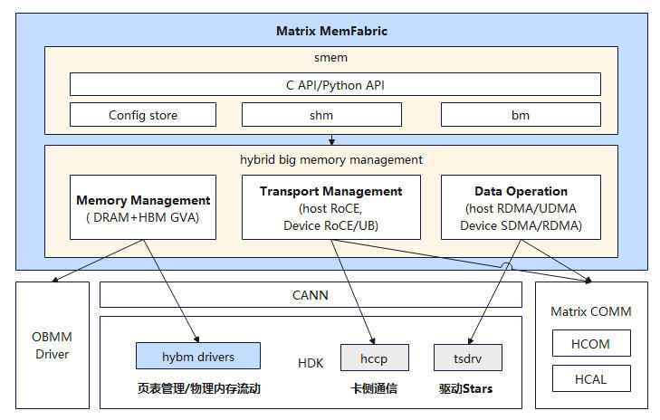
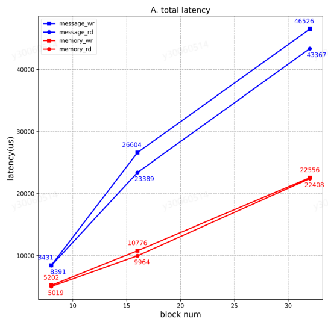
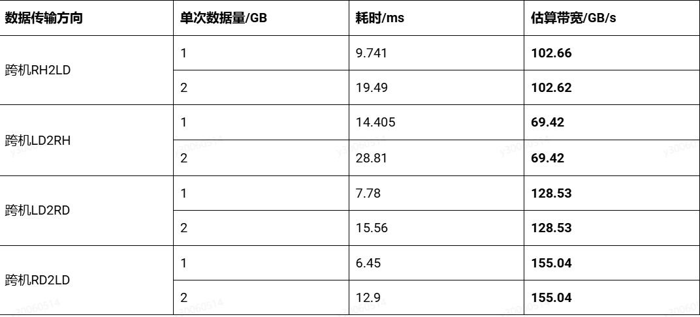
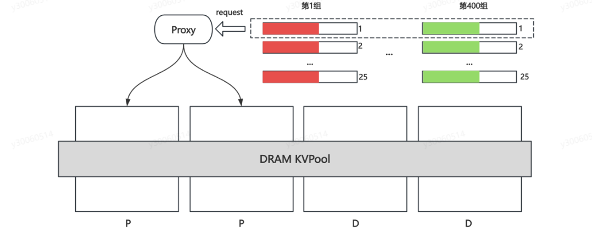
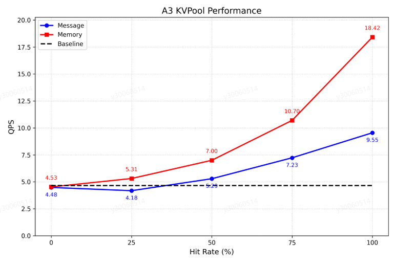

# memfabric_hybrid

## 🔄Latest News

- [2025/11] memfabric_hybrid项目预计2025年11月30日开源，开源社区地址为：https://gitcode.com/Ascend/memfabric_hybrid

## 🎉概述
MemFabric Hybrid面向昇腾NPU服务器和超节点，提供了构建基于HCCS互联的跨节点的HBM和DRAM的内存池的功能，可充分发挥A3超节点内D2D大带宽优势，无需配置额外Host网卡。它为用户提供了一个并行编程接口，并为跨多个NPU的内存的数据创建了一个全局地址空间，可以在NPU上通过使用MTE、RoCE、SDMA发起的数据操作来访问，还提供了由CPU发起的数据拷贝操作。




## 🧩核心组件及特性

- **Big Memory(BM)**
    - 支持创建统一内存空间存储数据
    - 支持同步数据拷贝，包含L2G, G2L, G2H, H2G
    - 自动分配rank (初始化时用户可以不指定rank,由BM内部自动生成,具体参见smem_bm_init接口)
    - 动态join和leave (参见smem_bm_join和smem_bm_leave接口)
    - 接口支持的语言: c, python

Note:
```angular2html
L2G: copy data from local HBM space to global HBM space
G2L: copy data from global HBM space to local HBM space
H2G: copy data from host DRAM memory to global HBM space
G2H: copy data from global HBM space to host DRAM memory
```

安装memfabri hybrid后，BM接口头文件位于
```${INSTALL_PATH}/mxc/memfabric_hybrid/latest/${arch}-${os}/include/smem/host/smem_bm.h```

- **Share Memory(SHM)**
    - 支持创建统一内存空间
    - 支持用户传入自定义数据在卡侧访问(参见smem_shm_set_extra_context和smem_shm_get_extra_context_addr接口)
    - 支持host侧全局barrier和allgather(参见smem_shm_control_barrier和smem_shm_control_allgather接口)
    - 支持超节点内，卡侧通过MTE直接访问统一内存
    - 卡侧提供基础copy接口
    - 接口支持的语言: c, python

安装memfabri hybrid后，SHM接口头文件位于
```
${INSTALL_PATH}/mxc/memfabric_hybrid/latest/${arch}-${os}/include/smem/host/smem_shm.h

${INSTALL_PATH}/mxc/memfabric_hybrid/latest/${arch}-${os}/include/smem/device/smem_shm_aicore_base_api.h
```


## 🔍目录结构

```
${INSTALL_PATH}/
    |--mxc
          |--memfabric_hybrid
              |-- latest
              |-- set_env.sh
              |-- ${version}
                   |-- ${arch}-${os}
                        |-- include    (头文件)
                        |-- lib64      (so库)
                        |-- whl        (python的whl包)
                   |-- uninstall.sh
                   |-- version.info

default ${INSTALL_PATH} is /usr/local/
```


## 🔥性能表现

### 时延测试
读写时延性能是一个衡量缓存池的重要指标，为对比测试内存语义和非内存语义，我们将MemFabric对接到MoonCake TE（MoonCake是业界开源的一款的分布式缓存软件）进行如下的测试：
- 测试环境：2台昇腾A3机器，节点1每个die对应一个写进程，节点2每个die对应一个读进程，共32个进程
- 测试步骤：
  1) 构造block模拟DeepSeek-R1模型KV大小，即：61*128K + 61*16K = 8784KB ≈ 8.57MB，共122个离散地址。
  2) 节点1所有进程调用put接口写入指定个数（8、16、32）的block，每个进程写512次，统计写总时延。
  3) 节点2所有进程调用get接口读取所有写入的block，每个进程共计读取512次，统计读总时延。
分别对内存语义（Memory标识，下同）和非内存语义（Message标识，下同）统计测试结果，绘制曲线对比如所示。



### 单DIE带宽测试
- 性能评估指标：单die跨机传输带宽。
- 测试环境：2台昇腾A3机器
- 测试步骤：
  1) 构造单次拷贝数据大小1G/2G，连续内存
  2) 进行RH2LD测试，循环调用RH2LD拷贝1000次，取时延平均值
  3) 进行LD2RH测试，循环调用LD2RH拷贝1000次，取时延平均值
  4) 进行LD2RD测试，循环调用LD2RD拷贝1000次，取时延平均值
  5) 进行RD2LD测试，循环调用RD2LD拷贝1000次，取时延平均值


### PrefixCache吞吐测试
在大模型推理中，尤其是需要长上下文或高并发处理请求时，KVCache的高效复用与调度成为关键，此类缓存需要在HBM、DRAM乃至 SSD之间频繁迁移，若无良好的池化支持，将导致显存拥堵和请求阻塞，因此，此场景是内存池化软件重要的应用场景。MemFabric +MemCache（类似MoonCake Store的分布式缓存软件，此文不赘述）联合国内某头部互联网AI部门，基于vLLM推理框架在昇腾A3超节点进行Prefill吞吐QPS测试，测试系统示意图如下图所示。



- 性能评估指标：2P1D（D是2机）共4台昇腾A3机器，观察P节点归一化QPS的提升，测试模型为DeepSeek-R1
-  PrefixCache KVPool配置：每台机器贡献40GB*16die共640GB的DRAM内存，组成4机共2.5TB的KVPool，存储最高水位85%，超过最高水位后淘汰5%
-  benchmark 配置：请求输入长度为4K，输出token为1；一共400组不同的前缀，每组发送25个请求，共约1w条请求；
-  命中率构造：每组请求通过相同前缀长度来构造命中率，在发送请求时，先发送每组的第一个请求（400个），再发送每组的第二个请求（400个）以此类推；在发送每组第二个请求时，保障了其第一个请求不会被换出。
- 分别对无KVPool（Baseline标识），内存语义KVPool（Memory标识）和非内存语义KVPool（Message标识）进行测试，绘制QPS吞吐对比曲线如图。



## 🚀快速入门

请访问以下文档获取简易教程。

- [构建](./doc/build.md)：介绍组件编译和安装教程。

- 样例执行：具体流程参考example目录下各个样例中对应的README.md，example及其他样例代码仅供参考，在生产环境中请谨慎使用。

## 📑学习教程

- [C接口](./doc/API.md)：C接口介绍以及C接口对应的API列表

- [python接口](./doc/pythonAPI.md)：python接口介绍以及python接口对应的API列表


## 📦软件硬件配套说明
- 硬件型号支持
  - Atlas 800I A2/A3 系列产品
  - Atlas 800T A2/A3 系列产品
- 平台：aarch64/x86
- 配套软件：驱动固件 Ascend HDK 25.0.RC1、 CANN 8.1.RC1及之后版本
- cmake >= 3.19  
- GLIBC >= 2.28


## 📝相关信息

- [安全声明](./doc/SECURITYNOTE.md)

- [许可证](./LICENSE)