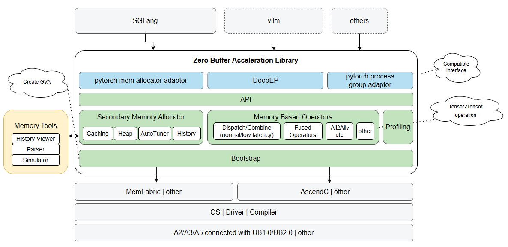

## 🔄Latest News

* Open source on June 1st, 2026

## 🎉Introduction

ZBAL pronounced [zi:bəl], stands for Zero Buffer Acceleration Library. It contains a bunch of well tuned operators
for LLM inference and training, which has two key advantages: <b>zero intermediate buffer</b> and <b>blazing fast</b>.



## 🧩Core Features

Two major features:

* Secondary memory allocator: which takes charge of memory allocation of GVA of low device
* Bunch of key communication operations: Dispatch/Combine Normal and Low Latency, some classic communication operations

*Hardware support matrix with Ascend:*

| Communication operations           | A3 Single Node | A3 SuperPod |
|------------------------------------|----------------|-------------|
| Dispatch Normal with Quant         | Y              | Y           |
| Dispatch Normal without Quant      | Y              | Y           |
| Combine Normal without Quant       | Y              | Y           |
| Dispatch Low Latency with Quant    | Y              | Y           |
| Dispatch Low Latency without Quant | Y              | Y           |
| Combine Low Latency without Quant  | Y              | Y           |
| AllToAll                           | Y              | Y           |
| ReduceScatter                      | Y              | Y           |
| AllGather                          | Y              | Y           |
| AllReduce                          | Y              | Y           |

## 🔥Performance

* [Details](./doc/performance/prof.md)

## 🚀Quickstart

1. Install memfabric_hybrid package.

```bash
pip install memfabric_hybrid
```
The version of memfabric_hybrid must be higher than 1.0.7

2. Git clone current repo and build wheel package.

```bash
git clone https://gitcode.com/victor7wang/sgl-kernel-npu.git
cd sgl-kernel-npu/contrib/zbal/src/python/
rm -rf build dist zbal.*   # optional
python3 setup.py bdist_wheel
```

3. Install wheel package.

```bash
cd sgl-kernel-npu/contrib/zbal/src/python/dist
pip uninstall memfabric_zbal -y
pip install memfabric_zbal*
```

4. Run a python testcase to check installation. More running details please check the test shell script.

```bash
cd sgl-kernel-npu/contrib/zbal/test/python/operators/alltoall/
bash test_zbal_alltoall.sh
```

## 📑How to use

* [Get Started](./doc/user_guide/get_started.md)
* [API Reference](./doc/api/api.md)

## 📦Pre-request hardware and software

- Hardware
    - Device:
    - Host: aarch64/x86

- Software:
    - CANN 8.3.RC1 and later
    - cmake >= 3.19
    - GLIBC >= 2.28

## 📝 Other information

- [Security Note](./doc/SECURITYNOTE.md)

- [License](./LICENSE)
