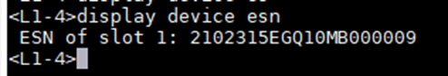
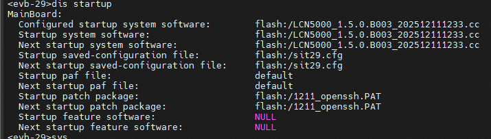

# LingQu Computing Network 安装包升级示例  

<span style="font-size: 1.5em; color:red">**下述步骤仅供参考，具体操作请以 [升级指导书](https://support.huawei.com/enterprise/zh/ascend-computing/lingqu-computing-network-pid-258003841) 和运维人员为准**</span>

## 1520环境升级前检查
1、登录1520 L1之后，可以在1520上执行以下命令，反查L1物理设备的ESN，以便确保此L1确为待操作服务器上的交换机，查询示例结果如下：
```
display device esn
```


##  LingQu Computing Network 安装

<span style="font-size: 1.2em; color:red">**下述步骤以LCN5000_1.5.0.B003_202512111233版本为例，具体操作请以商用版本为准**</span>

```
start sys LCN5000_1.5.0.B003_202512111233.cc
```
- 完成安装后执行 reboot 重启L1交换机
 - <span style="color:red">注：重启 L1 交换机会导致对应的A3服务器重启，同时与待操作L1相连的所有L2，会监控到此L1端口（管理IP）相关的多种告警： </span>  
        ① L1端口LinkDown；    
        ② L1端口相连的IPv6的协议状态down；   
        ③ 降Lane的告警；   
        ④ 光模块无效的告警；  
        ⑤ BGP告警；  
   因为在A3超节点中每台L1都会和56台L2相连，所以重启一个L1交换机，每种告警都会产生56个。

## 检查是否安装成功
重启之后可以通过以下命令查询是否升级成功
```
display startup 
```

