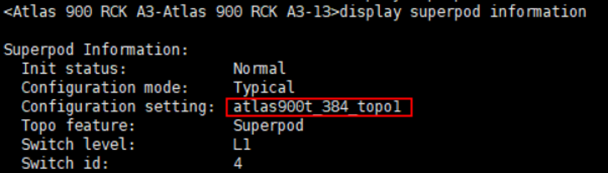

# CC包安装

## 1520环境校验
1、登录1520之后，可以在1520上执行以下命令，反查L1物理设备的ESN，以便确保此L1确为待操作服务器上的交换机，查询示例结果如下：
```
display device esn
```


2、查询L1上当前配置是否为atlas900t_384_topo1配置。


## CC包安装
```
start sys LCN5000_1.5.0.B003_202512040743.cc
```
- 完成安装后执行reboot重启L1交换机
 - 注：重启 L1 交换机会导致对应的A3服务器重启，同时与待操作L1相连的所有L2，会监控到此L1端口（管理IP）相关的多种告警：
        ① L1端口LinkDown；
        ② L1端口相连的IPv6的协议状态down；
        ③ 降Lane的告警；
        ④ 光模块无效的告警；
        ⑤ BGP告警；
   因为在A3超节点中每台L1都会和56台L2相连，所以重启一个L1交换机，每种告警都会产生56个,可以忽略上述告警

## 检查是否安装成功
重启之后可以通过以下命令查询是否替换成功
```
display startup 
```

