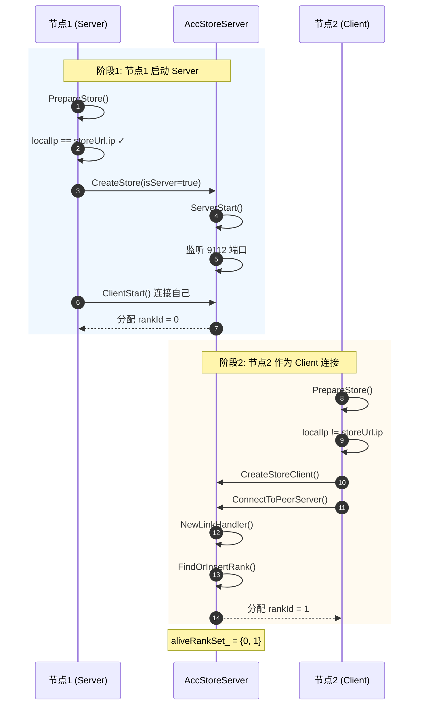
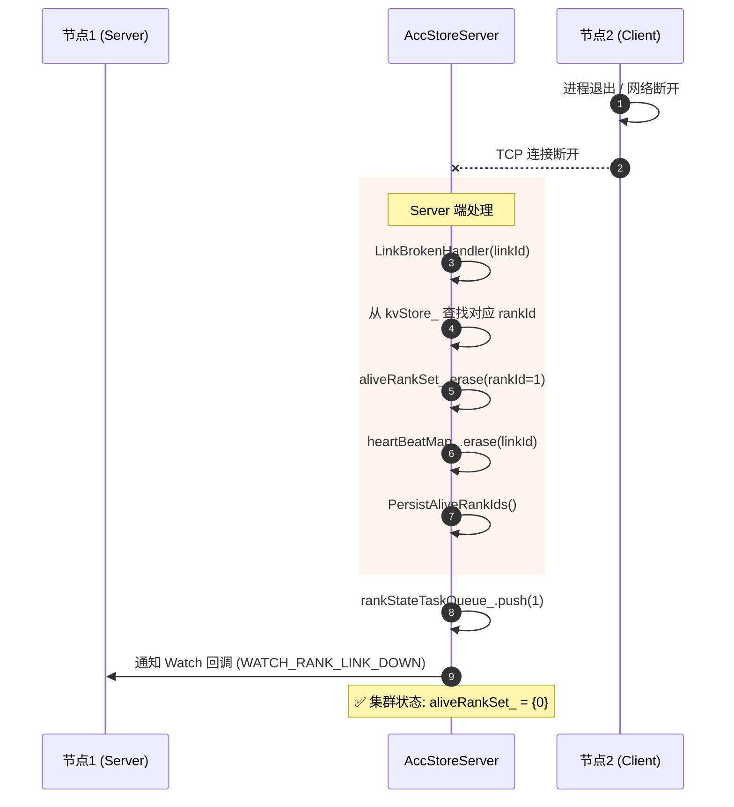
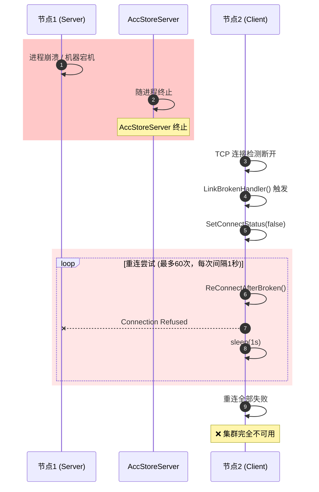
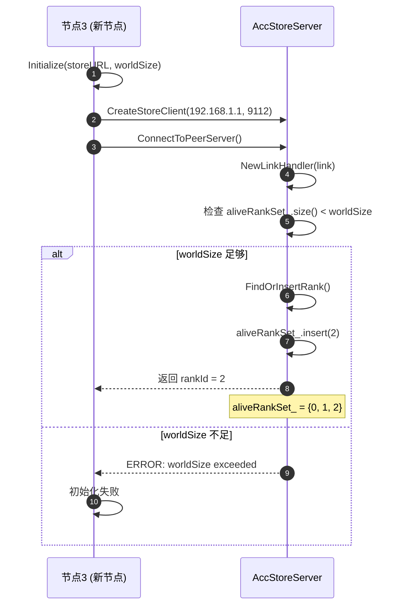
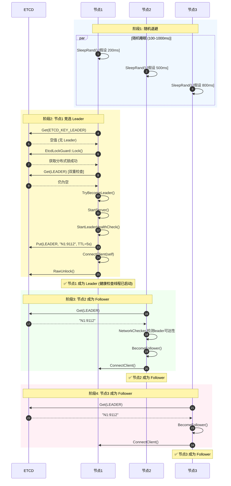
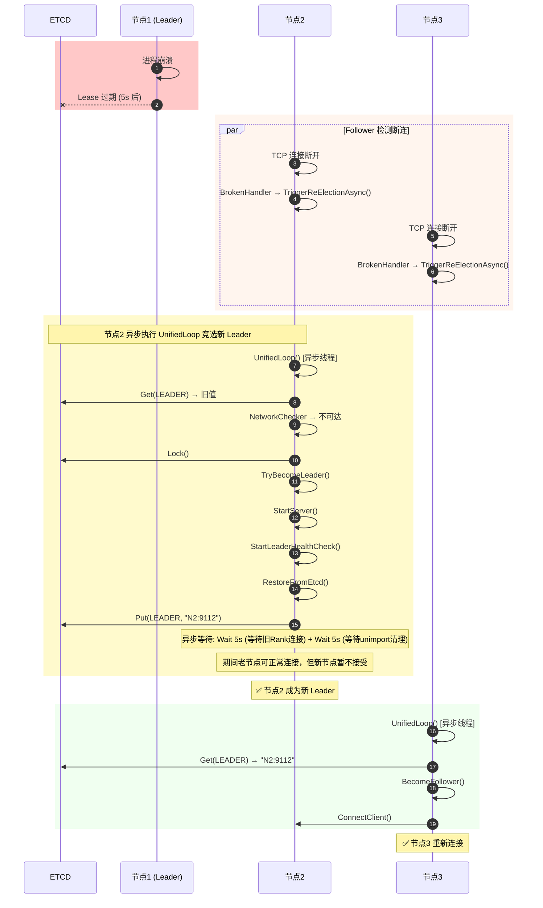
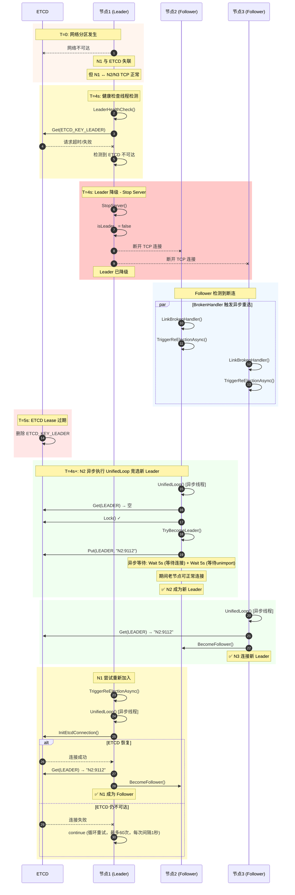
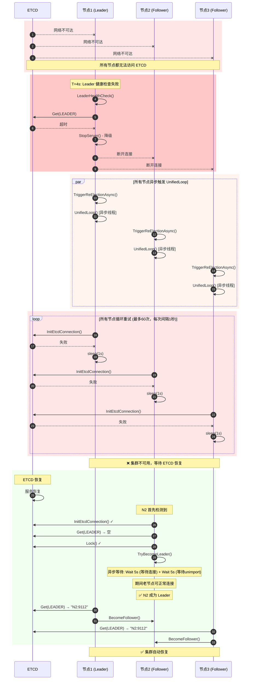
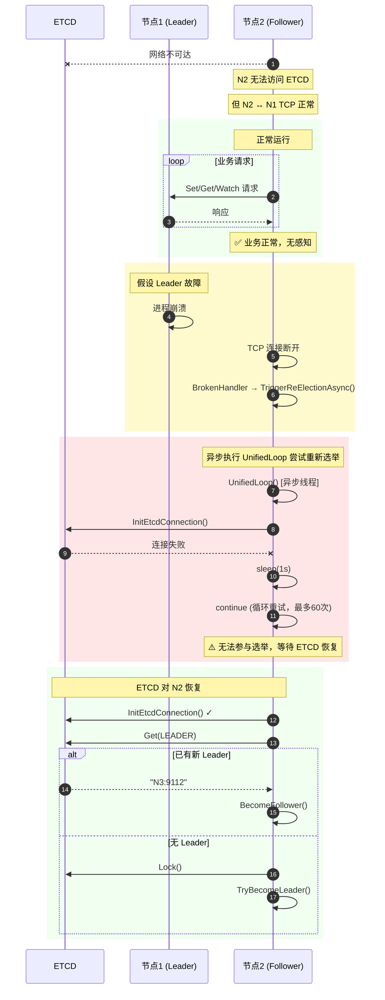

# config_store_cluster_ha

> Config Store 实现分析 (引入ETCD和降级机制)

---

## 目录

1. [架构概述](#架构概述)
2. [第一部分：无 ETCD 模式](#第一部分无-etcd-模式)
3. [第二部分：ETCD 模式 - 正常流程](#第二部分etcd-模式---正常流程)
4. [第三部分：ETCD 模式 - 网络分区](#第三部分etcd-模式---网络分区)

---

## 架构概述

### 核心组件

| 组件                  | 职责                                              | 关键常量                                      |
|---------------------|-------------------------------------------------|-------------------------------------------|
| `TcpConfigStore`    | TCP 配置存储，Server/Client 双角色                      | `CONNECT_RETRY_MAX_TIMES = 60`            |
| `AccStoreServer`    | TCP Server 实现，KV 存储管理                           | `HEARTBEAT_INTERVAL`, `HEARTBEAT_TIMEOUT` |
| `HybridConfigStore` | ETCD 模式混合存储，基于 TcpConfigStore 代理实现，负责 Leader 选举 | `ETCD_LEASE_TTL_SEC = 5`                  |
| `EtcdClientV3`      | ETCD v3 客户端，分布式协调，封装go api，c接口->c++接口           | Lease 自动续约                                |
| `NetworkChecker`    | 网络连通性检查 (非阻塞)，Server连通性检查，查找本地可用bind端口          | `CONNECTION_TIMEOUT_SEC = 3`              |

### 关键时序参数

| 参数             | 值                   | 说明                                               |
|----------------|---------------------|--------------------------------------------------|
| ETCD Lease TTL | 5 秒                 | Leader 注册信息的有效期                                  |
| Leader 健康检查间隔  | 4 秒                 | 检测 ETCD 连接和 Lease 状态                             |
| 随机退避           | 100-1000ms          | 避免选举惊群                                           |
| 网络检查超时         | 3 秒                 | 判断 Leader 是否可达                                   |
| 心跳超时           | 3 秒                 | 心跳检测超时时间                                         |
| 恢复等待           | 5秒wait连接 + 5秒wait清理 | 新 Leader 等待旧 Rank 重连，再等待unimport (异步执行，不阻塞老节点连接) |
| 客户端重连次数        | 60 次 (间隔1秒)         | Client 最大重连尝试次数，每次间隔1秒                           |

### ETCD 存储的关键 Key

| Key 常量                   | 示例值                | TTL | 用途                      |
|--------------------------|--------------------|-----|-------------------------|
| `ETCD_KEY_LEADER`        | "192.168.1.1:9112" | 5s  | 当前 Leader 地址            |
| `ETCD_KEY_LEADER_STATUS` | "true"             | 5s  | Leader 就绪状态，接受新的rank分配  |
| `ETCD_KEY_WORLD_SIZE`    | "3"                | 5s  | 集群大小                    |
| `ETCD_KEY_ALIVE_RANKS`   | "0,1,2"            | 5s  | 存活 Rank 列表，新leader，等待恢复 |

---

## 第一部分：无 ETCD 模式

### 1.1 初始化流程

**场景设定**: 节点1 (192.168.1.1:9112) 为固定的 Config Store Server 地址，节点2 作为 Client 连接。

### 1.2 节点2 (Follower) 下线 ✅

**结果**: 集群继续正常运行，Server 自动清理节点2 的状态，通知其他 follower。

### 1.3 节点1 (Config Store) 下线 ⚠️ 灾难性故障

> **严重问题**: 无 ETCD 模式下，Config Store Server 是**单点故障 (SPOF)**。Server 下线后，整个集群不可用，必须人工恢复！

### 1.4 新节点3 加入集群

---

## 第二部分：ETCD 模式 - 正常流程

### 2.1 三节点同时启动 (Leader 选举)

**场景设定**: 三个节点同时启动,通过 ETCD 进行 Leader 选举。使用随机退避 (100-1000ms) 避免惊群效应。

### 2.2 Leader 进程崩溃 ✅ 自动故障转移

---

## 第三部分：ETCD 模式 - 网络分区

### 3.1 Leader 与 ETCD 失联 (降级机制生效) ✅

> **降级机制保证安全**: Leader 检测到与 ETCD 失联后，主动停止 TCP Server，断开与所有 Follower 的连接，避免脑裂。

#### 安全保证

| 保证项  | 说明                       |
|------|--------------------------|
| 快速检测 | Leader 在 4 秒内检测到 ETCD 失联 |
| 主动降级 | 主动停止 TCP Server，断开所有连接   |
| 无脑裂  | 不会出现双主                   |
| 触发重选 | Follower 感知到断连后异步触发重新选举  |

#### 时序保证

| 事件        | 时间                |
|-----------|-------------------|
| 健康检查间隔    | 4 秒               |
| Lease TTL | 5 秒               |
| 心跳超时      | 3 秒               |
| Leader 降级 | ~4s (健康检查周期触发后立即) |

**确保旧 Leader 先降级再有新 Leader 产生。**

### 3.2 整个集群与 ETCD 失联 ⚠️ 服务中断

> **场景描述**: 所有节点都无法连接 ETCD。由于 Leader 有降级机制，检测到 ETCD 不可达后会主动停止服务。

#### 关键点

- 由于 Leader 有降级机制，整个集群会停止服务
- 这是**正确的行为**：宁可停止服务也不能出现脑裂
- ETCD 恢复后，集群自动恢复正常

### 3.3 Follower 与 ETCD 失联 ✅ 影响有限

> **影响分析**: Follower 在正常运行时不需要访问 ETCD，仅在重新选举时需要。当前连接保持正常。

#### 影响矩阵

| 状态      | 影响                                    |
|---------|---------------------------------------|
| ✅ 不受影响  | 已建立的 TCP 连接正常、KV 存储读写正常、Watch 通知正常    |
| ⚠️ 潜在影响 | 如果 Leader 故障，无法参与选举；需等待 ETCD 恢复才能重新加入 |