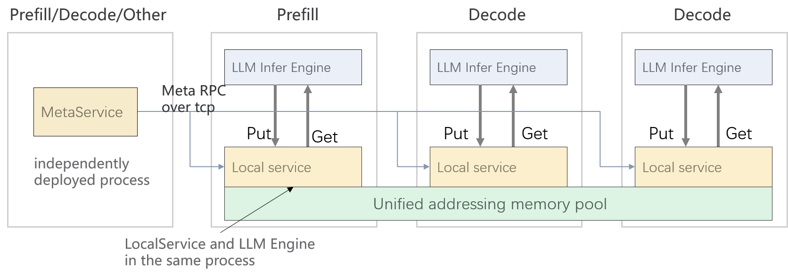

# MemCache
## 概述
MemCache是针对LLM推理场景设计的高性能分布式键值 KV Cache 存储引擎，其主要特性包括：
* **基于对象操作的API**：支持批量和非批量的put/get/exist/remove操作
* **支持多副本**：单个对象支持多副本放置到不同的localservice，默认是单副本
* **高带宽低时延**：基于MemFabric作为多级内存和多通路传输的底座，在Ascend硬件上，基于device_rdma(A2)、device_sdma(A3)、host_rdma(A2/A3)等路径实现onecopy传输，提供高带宽，低时延的读写能力。
* **支持扩缩容**：支持localservice动态加入和移除
* **HA能力**：在K8S集群中，metaservice支持多活能力，提供尽力而为的HA能力。
  

## 架构

MemCache包含LocalService和MetaService两大核心模块，基于MemFabric构建能力。
* **MetaService**：负责管理整个集群的内存池空间分配和元数据管理，并处理LocalService的加入与退出。MetaService作为独立进程运行，提供两种启动方式：**python API启动**；**二进制启动**，详见***安装部署***章节。    
MetaService支持两种部署形态：      
**1、单点模式**：MetaService由单个进程组成，部署方式简单，但存在单点故障的问题。如果MetaService进程崩溃或无法访问，系统将无法继续提供服务，直至重新恢复为止。  
**2、HA模式**：该模式基于K8S的的ClusterIP Service和Lease资源构建，部署较为复杂，会部署多个MetaService进程实例，实现多活高可用。部署详见[MetaService HA](./memcache_metaservice_HA.md)    
    

* **LocalService**：负责承担如下功能：     
**客户端**：作为客户端，以whl/so形式作为共享库被应用进程加载调用API    
**内存提供者**：负责提供一段连续的内存区域作为内存池空间的一部分，其内存可以被其他LocalService实例基于地址直接访问。   


## KV读写路径
MemCache在LLM推理场景，核心能力是提供大容量内存池和高性能的H2D、D2H、**D2RH、RH2D** 数据传输，其中本地swap，即H2D、D2H为通用路径。D2RH、RH2D路径差异由下图所示（*此示意图为RH2D，推理block，即block4，由离散tensor组成，D2RH是反向过程，在此不赘述*）

* **路径0**：基于host_rdma，MemCache支持，性能受限于rdma网卡传输带宽，常见规格为100GE/200GE
* **路径1**：基于device D2D中转，利用device侧高带宽，对于在**Host1**发起读请求的应用，将block1传输到block4，需要**一次内部RPC和3次拷贝**，MemCache未支持此实现
* **路径2**：基于device_sdma(A3)/device_rdma(A2)，MemCache支持，对于在**Host1**发起读请求的应用，直接在Host1访问block1地址即可将其拷贝到block3，再将其拷贝到离散tensor组成的block4，**直接地址访问，无需内部RPC**，适用于block组成的tensor size较小，num较多的模型
* **路径3**：基于device_sdma(A3)/device_rdma(A2)，MemCache支持，对于在**Host1**发起读请求的应用，直接在Host1访问block1地址即可将其拷贝到block4，**直接地址访问，无需内部RPC**，适用于block组成的tensor size较大，num较少的模型


## API
MemCache提供三种形式的API: python、C++、C，具体详见[MemCache API](./memcache_api.md)

```python
import memcache        # 导入memcache
help(memcache)         # 查看memcache基础函数介绍
```


## 安装部署
### MetaService
* **python形式**：
*以下均以python311版本whl包（memcache-1.0.0-cp311-cp311-linux_aarch64.whl）为例*
```
1、安装whl包
pip install memcache-1.0.0-cp311-cp311-linux_aarch64.whl

2、设置配置文件环境变量
export MMC_META_CONFIG_PATH=/usr/local/mxc/memfabric_hybrid/latest/config/mmc-meta.conf

3、进入python控制台或者编写python脚本如下即可拉起进程：
from memcache import MetaService
MetaService.main()
```
* **bin形式**：
```
1、安装run包
run包格式为 mxc-memfabric-hybrid-${version}_${os}_${arch}.run
默认安装根路径为 /usr/local/
参考安装命令如下：
bash mxc-memfabric_hybrid-1.0.0_linux_aarch64.run

如果想要自定义安装路径，可以添加--install-path参数
bash mxc-memfabric_hybrid-1.0.0_linux_aarch64.run --install-path=${your path}
如果自定义安装路径，下述 /usr/local 需替换为 ${your path}

2、设置环境变量
source /usr/local/mxc/memfabric_hybrid/set_env.sh
export MMC_META_CONFIG_PATH=/usr/local/mxc/memfabric_hybrid/latest/config/mmc-meta.conf

3、拉起二进制
/usr/local/mxc/memfabric_hybrid/latest/aarch64-linux/bin/mmc_meta_service
```

### LocalService
* **whl（python）**：
```
1、安装whl包
pip install memcache-1.0.0-cp311-cp311-linux_aarch64.whl

2、设置配置文件环境变量
export MMC_LOCAL_CONFIG_PATH=/usr/local/mxc/memfabric_hybrid/latest/config/mmc-local.conf

3、通过memcache提供的接口初始化客户端并拉起localservice，执行数据写入、查询、获取、删除等，下面的脚本时一个示例：
python3 test_mmc_demo.py
```
  
* **so（C++）**：
```
1、导入头文件
#include "mmcache.h"

2、将 libmf_memcache.so 路径加入到 LD_LIBRARY_PATH 环境变量
export LD_LIBRARY_PATH=$LD_LIBRARY_PATH:${libmf_memcache.so path}

注：如果其所在路径已经在 PATH 或 LD_LIBRARY_PATH，则无需此步骤

3、调用API

```

## 配置
MemCache将MetaService和LocalService的公共配置部分抽取为配置文件，具体详见[MemCache Conf](./memcache_config.md)
