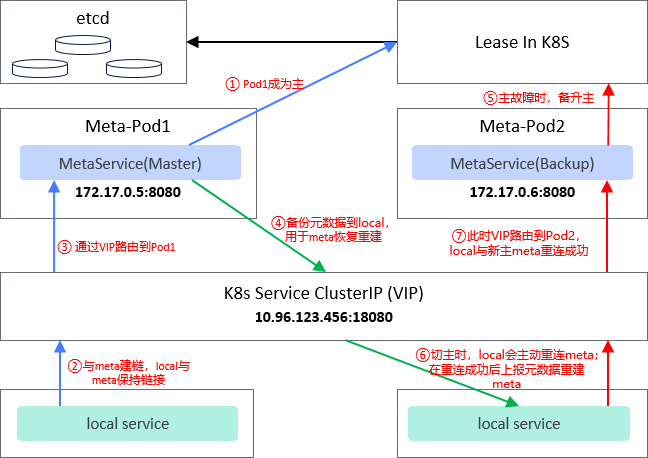

## K8S环境中MetaService主备高可用验证流程
本说明用于介绍如何在Kubernetes集群中，验证MetaService的主备高可用流程。在生产环境中，用户可以进行参考配置MetaService的主备高可用。

原理机制：基于K8S的的Service（type=ClusterIP）和Lease资源，实现MetaService的选主功能：
* Service(type=ClusterIp)：对所有的LocalService客户端，提供MetaService服务的统一访问能力，负责将客户端的访问请求路由转发到主MetaService（role=master的Pod为主节点）。
* Lease：提供分布式锁功能，记录主服务Pod名称和租约过期时间。
每个MetaService定时检查Lease资源，判断租约是否过期，如果过期，则尝试更新租约进行选主； 
主服务（leader）则定期续约。 当主节点故障，且租约过期后，其他MetaService节点竞争成为新的主节点（Leader），并更新自身标签role=master。



### 1. 在容器内，编译安装memcache和memfabric
在docker或containerd容器中，下载源码，并参考README内容，编译构建安装包并完成安装。

* 如何创建containerd容器：`nerdctl run -d -i -v /home:/home:rw --name <容器名称> <镜像名称>`
* 列出所有containerd容器：`ctr containers ls`
* 查看所有运行中的containerd容器：`ctr tasks ls`
* 启动containerd容器：`ctr tasks start -d  <容器名或ID>`
* 进入containerd容器内部：`ctr tasks exec -t --exec-id <唯一标识> <容器名或ID> <shell类型>`

**注意：业务服务过程中，由于需要采用python client访问K8S集群资源，因此需要在容器中安装kubernetes python client：`pip3 install kubernetes`**

### 2. 成功安装后，将容器提交为新的镜像

需要准备一个镜像仓，本地启动一个镜像仓服务（使用 nerdctl）
nerdctl run -d --name registry -p 5000:5000 -v /tmp/registry:/var/lib/registry registry:2

如果已有镜像仓，将命令中的 <镜像仓地址:端口> 改为用户自己的镜像仓地址

运行以下命令，将容器提交为镜像
```
nerdctl commit <容器名> <镜像仓地址:端口>/<镜像名>:<标签>
```

将新镜像，推送到镜像仓中
```
nerdctl push <镜像仓地址:端口>/<镜像名>:<标签>
```

使用`nerdctl images`查看所有容器镜像<br>
使用`nerdctl rmi <镜像仓地址:端口>/<镜像名>:<标签>`删除无用镜像


### 3. 采用新的镜像，创建Pod容器

在`./script/k8s_deploy`存放了相关的测试验证主备高可用的yaml文件，
只需要修改meta-pods-demo.yaml和local-pods-demo.yaml文件内容，将containers:image和InitContarners:image改为第二步push的镜像即可。

**注意：`./script/k8s_deploy`目录下所有的yaml文件，仅作样例参考，不能直接用于生产环境，用户可以基于样例进行修改定制**

```
1.创建命名空间、服务账号、角色，并将服务账号和角色进行绑定授权
kubectl apply -f account-role-demo.yaml

2.创建租约Lease
kubectl apply -f meta-lease-lock-demo.yaml

3.创建Cluster IP，ClusterIP#targetPort为MetaService的访问端口
kubectl apply -f meta-cluster-ip-demo.yaml

4.创建MetaService服务
kubectl apply -f meta-pods-demo.yaml

5.创建Local客户端
kubectl apply -f local-pods-demo.yaml
```

注意:
* mmc-meta.conf中meta_service_url为\<PodIP:targetPort\>
* mmc-local.conf中meta_service_url为\<ClusterIP:Port\>
* 为了方便测试，在样例yaml文件中，均采用了host网络启动Pod；在生产环境中需要修改，但是要保证客户端的PodIP可以互相访问。
* 所有K8S资源均需要置于同一命名空间中

### 4. 查询服务运行状态，并验证选主流程

#### 4.1 通过以下命令，查询服务运行状况

创建成功后查看集群中的Pods
```
# 查询所有的Pods
kubectl get pods -A -o wide 

# 查询指定命名空间的Pods
kubectl get pods -n ns-memcache -o wide 
```

拉起Pod后，查看meta-pods的详情，通过标签`role=master`观察当前的主备节点
```
查询meta-service-pod-0的详情
kubectl describe pod meta-service-pod-0 -n ns-memcache

查询meta-service-pod-1的详情
kubectl describe pod meta-service-pod-1 -n ns-memcache
```

查询ClusterIP详情，Endpoints为当前主服务的PodIP和端口号
```
kubectl describe service service-cluster-ip-memcache -n ns-memcache
```

查询租约Lease详情（Holder为当前主节点。此外，可以通过修改LeaseDurationSeconds，实时修改租约的过期时间）
```
kubectl describe lease lease-memcache -n ns-memcache
```

#### 4.2 通过以下命令，验证主备HA功能
基于K8S机制，删除一个Pod后，K8S会自动拉起一个新的Pod，以维持Pod数量的稳定。
所以当我们删除主节点Pod后，K8S会重新拉起该Pod；如果在租约有效期内，主节点无法恢复，则从节点会竞争成为新的主节点。

假设当前主节点为meta-service-pod-0，删除主Pod 0 
`kubectl delete pod meta-service-pod-0 -n ns-memcache`

通过`kubectl describe pod meta-service-pod-1 -n ns-memcache`, 查询Pod 1是否成为Leader主节点 ，
同时注意观察ClusterIP和Lease详情，是否一同变化


### 5. FAQ，常见问题排查方法

直接查看local-pod-0日志
`kubectl logs local-service-pod-0 -n ns-memcache `

如何进入Pod容器内部
```
kubectl exec -it local-service-pod-0 -n ns-memcache -c local-service -- bash
其中，local-service-pod-0为pod名称，local-service为容器名称
```

**建议**：<br>启动容器服务时，将服务日志写入宿主机或共享目录中，便于观察业务运行状况，或定位问题。需要将宿主机目录挂在到Pod容器中。
<br>在样例yaml文件中，已经将home目录挂载到了容器内部，因此可以：
<br>将meta日志路径配置为`/home/memcache`，则对应的业务日志会写到`/home/memcache/logs/mmc-meta.log`文件中
<br>将local的测试输出重定向到`/home/memcache/logs/mmc-local.log`文件中<br>
（注意local-pods-demo.yaml中的业务启动命令
`exec python3 /usr/local/mxc/memfabric_hybrid/latest/aarch64-linux/script/ha/test-mmc-meta-ha.py > /home/memcache/logs/mmc-local.log 2>&1`）